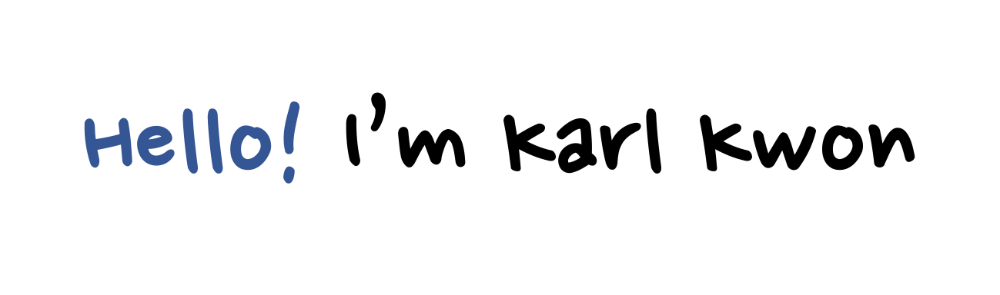

<!--  -->
<!--  -->
<!--  -->

<!-- |  |  | 
| ------------- | ------------- |-->

<!-- #### Repositories

 -->

💬 Ask me about anything [here](https://github.com/kyeongan/kyeongan/issues)

<!--
**Kyeongan/Kyeongan** is a ✨ _special_ ✨ repository because its `README.md` (this file) appears on your GitHub profile.

Here are some ideas to get you started:

- 🔭 I’m currently working on ...
- 🌱 I’m currently learning ...
- 👯 I’m looking to collaborate on ...
- 🤔 I’m looking for help with ...
- 💬 Ask me about ...
- 📫 How to reach me: ...
- 😄 Pronouns: ...
- ⚡ Fun fact: ...
-->
